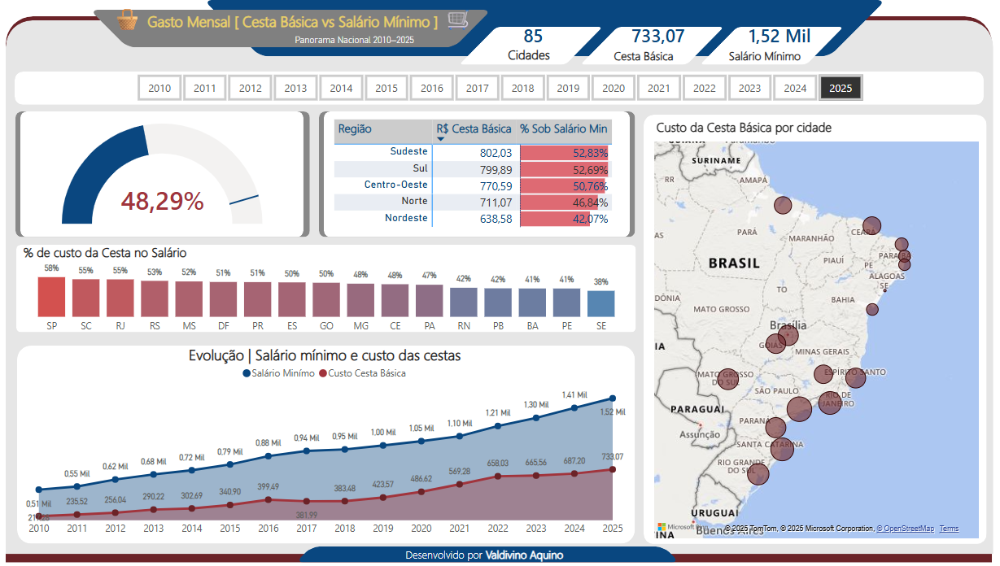
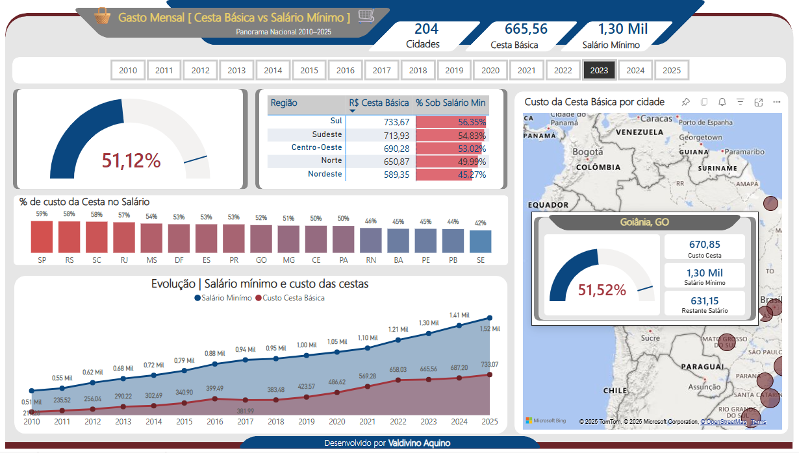

# 📊 Gasto Mensal com Cesta Básica vs Salário Mínimo
Panorama Nacional (2010–2025)


---


Este projeto apresenta um **dashboard interativo em Power BI** que analisa a evolução do custo mensal da cesta básica nas capitais brasileiras em relação ao salário mínimo nacional, no período de **2010 a 2025**.

## 🎯 Objetivo

Oferecer uma visualização clara e acessível sobre o poder de compra dos brasileiros, destacando:
- A evolução histórica do custo da cesta básica.
- A porcentagem do salário mínimo comprometida com esses gastos essenciais.
- As diferenças regionais e estaduais ao longo dos anos.

---

## 🧾 Visão Geral do Dashboard

### 🔹 Indicadores Principais
- **204 cidades analisadas**
- **R$ 665,56**: média nacional da cesta básica em 2023
- **R$ 1.300,00**: salário mínimo nacional em 2023

### 🔹 Análises Disponíveis
- **% de comprometimento do salário mínimo** por estado e região
- **Gráfico histórico**: evolução do salário mínimo x custo da cesta (2010–2025)
- **Mapa interativo** com custo por cidade e tooltip detalhado
- **Tabela por região** com valores e percentuais atualizados

### ℹ️ Informações Detalhadas do Tooltip (Mapa)
Ao passar o mouse sobre uma cidade no mapa, são exibidas informações completas como:
- **Nome da cidade/UF**
- **Valor da cesta básica**
- **Salário mínimo vigente no ano selecionado**
- **Porcentagem da cesta sobre o salário**
- **Valor restante após o gasto com a cesta**

Exemplo:
- Goiânia, GO
  - Custo da Cesta: R$ 670,85
  - Salário Mínimo: R$ 1.300,00
  - % do Salário: 51,52%
  - Restante do Salário: R$ 631,15

---

## 🖥️ Tecnologias Utilizadas

| Tecnologia   | Descrição                                      |
|--------------|------------------------------------------------|
| Power BI     | Desenvolvimento do dashboard                   |
| DAX          | Cálculo de medidas como % do salário mínimo    |
| Power Query  | Transformação e limpeza de dados               |
| OpenStreetMap + Bing | Mapa geográfico com visualização por bolhas |

---

## 🗂️ Estrutura do Projeto

```
📁 dashboard-cesta-basica
├── 📁 assets
│   └── dashboard_2025.png (imagem do dashboard)
├── 📄 README.md
└── 📄 LICENSE (opcional)
```

---

## 🚀 Possibilidades Futuras

- Filtros interativos por cidade/estado
- Variação percentual ano a ano (inflação e ganho real)
- Análise por grupos alimentares da cesta

---

## 📊 Fontes de Dados (sugestivas)

- [DIEESE – Departamento Intersindical de Estatística e Estudos Socioeconômicos](https://www.dieese.org.br/)
- [IBGE – Instituto Brasileiro de Geografia e Estatística](https://www.ibge.gov.br/)
- [Governo Federal – Portal da Legislação sobre o salário mínimo](https://www.gov.br/)

> Obs.: Os dados podem ser simulados para fins educacionais, analíticos ou demonstrativos.

---

## 📘 Licença

Este projeto está licenciado sob a [MIT License](LICENSE).  

---

## 👨‍💻 Autor

**Valdivino A. Aquino**  
Profissional de TI | Consultor em BI | Especialista em Power BI, Python e Dados Públicos  
[LinkedIn](www.linkedin.com/in/valdivino-aquino-ti-goiania) | [VisionIT Consulting](https://visionint.com.br)

---

> 💡 Se você gostou deste projeto, sinta-se à vontade para deixar uma estrela ⭐ no repositório!
